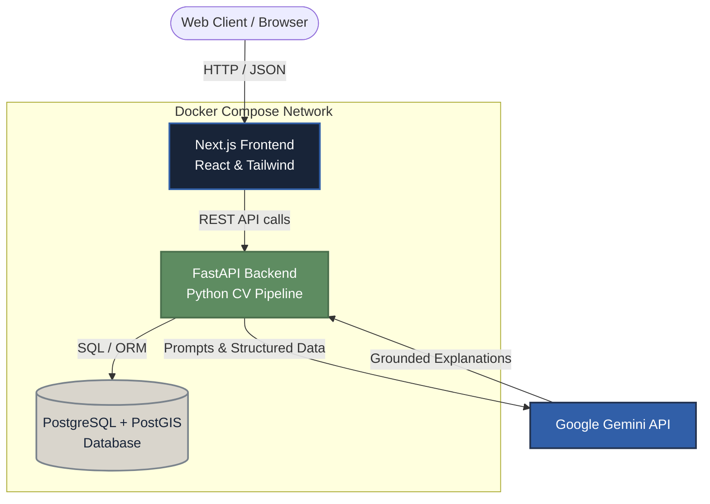
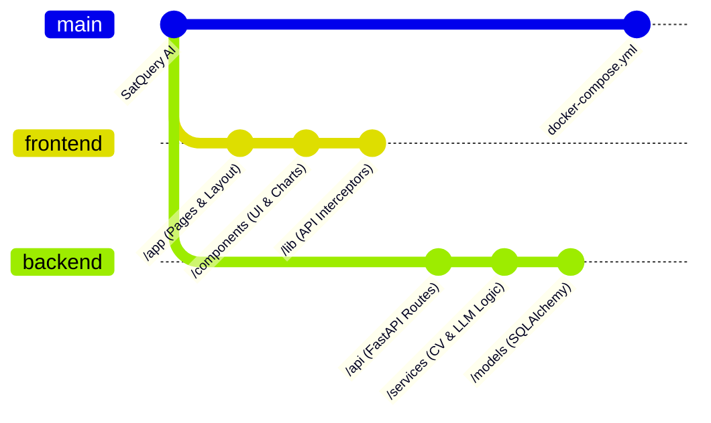

# SatQuery AI 🌍🛰️

**SatQuery AI** is a vision-language and geospatial intelligence platform for understanding satellite imagery using natural-language queries.

Rather than relying on complex GIS workflows, SatQuery allows you to upload imagery (e.g., GeoTIFFs), ask questions in plain English ("Where is the vegetation concentrated?"), and receive grounded, explainable answers powered by computer vision and Large Language Models.

---

## 🏗️ Architecture

The platform follows a modern decoupled architecture using Next.js (React) for the frontend and FastAPI (Python) for the geospatial backend, fully containerized with Docker.



## 🛠️ Tech Stack

### Frontend
* **Framework:** Next.js 14 (App Router)
* **Styling:** Tailwind CSS (Vanilla CSS utilities)
* **Icons:** Lucide React
* **Mapping:** React Simple Maps / Leaflet (for geospatial viz)

### Backend
* **Framework:** FastAPI (Python 3.11)
* **Authentication:** JWT via `python-jose`, passwords via `passlib[bcrypt]`
* **Database:** PostgreSQL with PostGIS extension
* **ORM:** SQLAlchemy + Alembic
* **Geospatial & ML:** `rasterio`, `scikit-image`, `numpy`
* **LLM Integration:** `google-generativeai` (Gemini)

---

## 🚀 Getting Started

The entire application is containerized and requires only Docker and Docker Compose to run locally.

### 1. Prerequisites
- Docker Engine & Docker Compose installed.

### 2. Environment Variables
Create a `.env` file in the `backend/` directory with the following variables:
```env
# backend/.env
GEMINI_API_KEY="your-google-gemini-api-key"
DEMO_MODE="true"  # Set to "false" to use real Gemini API instead of mocks
```

### 3. Build and Run
Start the application network using Docker Compose from the root directory:
```bash
docker compose up --build -d
```
This command spins up three containers:
1. `satquery-ai-db-1` (PostgreSQL running on port 5433)
2. `satquery-ai-backend-1` (FastAPI running on port 8000)
3. `satquery-ai-frontend-1` (Next.js running on port 3000)

### 4. Create an Admin Account
To access the platform, you must securely seed an Administrator account in the backend container:
```bash
docker exec satquery-ai-backend-1 python create_admin.py --name "Admin User" --email "admin@satquery.ai" --password "SatQuery123!"
```

### 5. Access the Application
- **Landing Page:** [http://localhost:3000](http://localhost:3000)
- **Application Dashboard:** [http://localhost:3000/dashboard](http://localhost:3000/dashboard)
- **Backend API Docs (Swagger):** [http://localhost:8000/docs](http://localhost:8000/docs)

---

## 📂 Project Structure



### Key Directories
- `frontend/`: Next.js web application. Handles state management, JWT persistence, and data visualization.
- `backend/app/api/`: REST API endpoints grouped by feature (Auth, Admin, Imagery, Projects).
- `backend/app/services/`: Core logic layers. Contains the CV pipeline (segmentation, object detection) and the `vision_language_service.py` that translates data into prompts.
- `backend/app/models/`: SQLAlchemy ORM database schemas.

---

## 🔒 Authentication & Roles
SatQuery uses a strict Role-Based Access Control (RBAC) system. 
- **USER:** Default role. Can upload imagery, create projects, and run queries.
- **ADMIN:** Granted securely via backend. Has access to the `/admin` dashboard to view system stats, manage users, and inspect API usage.

The frontend never transmits role data directly; it is exclusively determined and enforced by the FastAPI backend during the JWT lifecycle.
